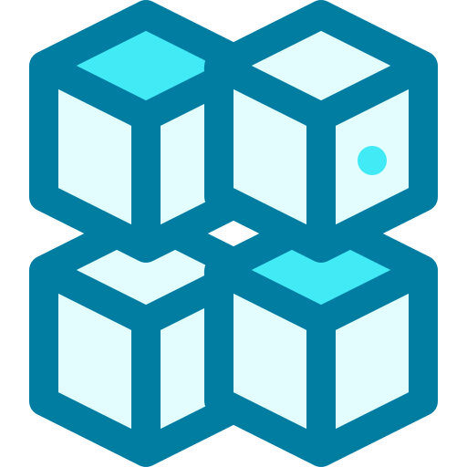
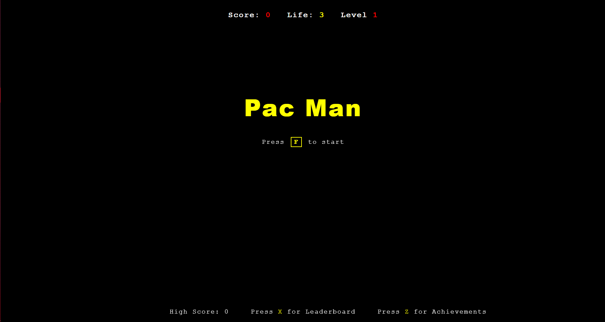
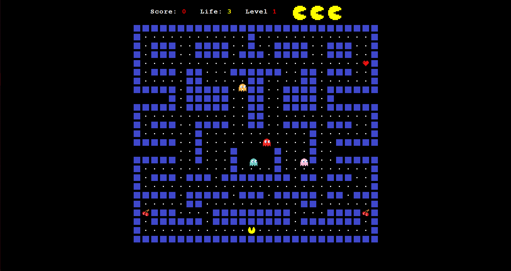
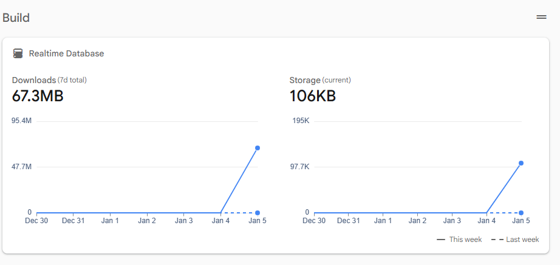
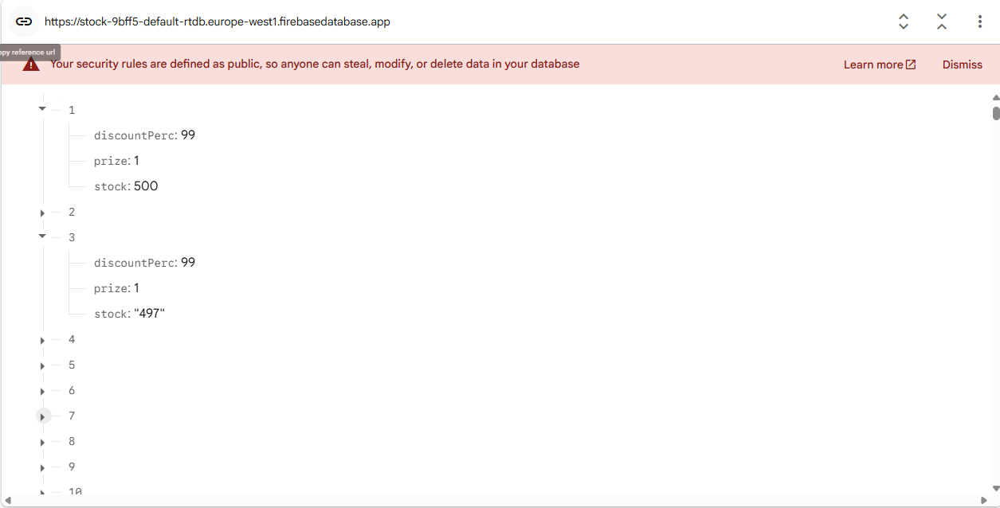
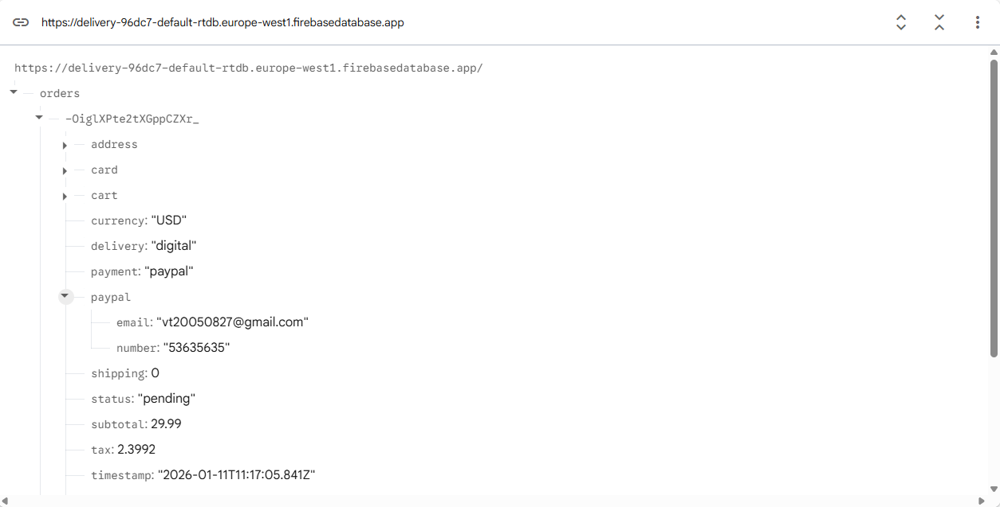
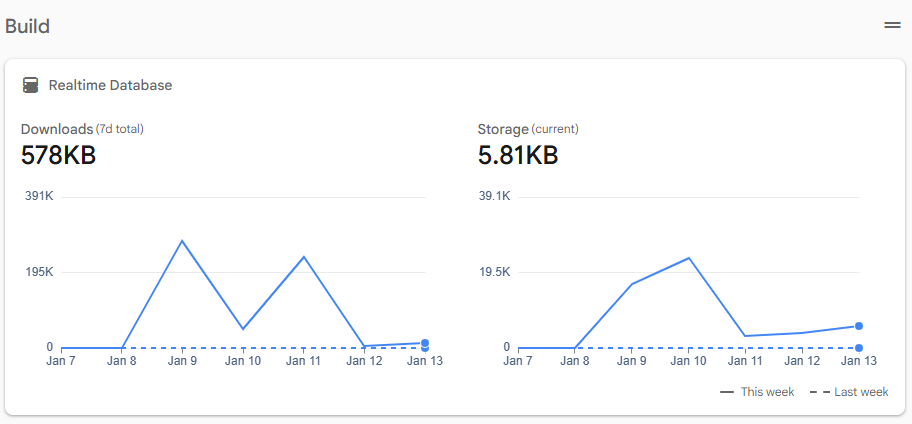
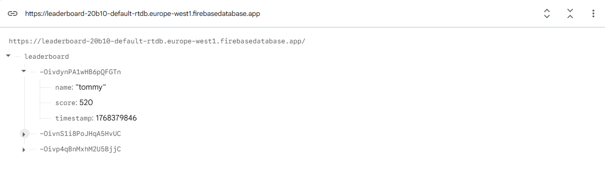

<div align="center">
  <br>
  <h2><strong>Fragstore - Game Webshop</strong></h2>
</div>

<div align="center">
  
    
 <br>

  


</div>


<br>
<div align="center">


<br>

 
 

<br>


<br>


<br>

<br>

</div>


### About
</img><br>
</img>

**Fragstore** is a modern webshop for games featuring a sleek, responsive design and dynamic functionality. Browse, purchase, and discover hidden gems—including **3 secret games** waiting to be unlocked by curious explorers.


### Key Features

- **User System** – Secure Sign Up and Login for personalized experiences  
- **Browse & Search** – Explore a vast catalog of games, gift cards via advanced filtering  
- **Shopping Cart** – Add items to cart, review, and purchase seamlessly  
- **Wishlist** – Save your favorite games and products for later  
- **Purchase Products** – Buy games and gift cards with integrated PayPal payment  
- **Secret Games** – Discover 3 hidden Easter eggs and unlockable games 
- **Real-time Updates** – Stay informed about new releases, deals, and latest game awards  
- **Responsive Design** – Optimized for mobile and desktop devices  
- **Enhanced Filtering & Sorting** – Quickly find products by category, price and so on
- **Language Selection** - For up to 6+ available languages

### 📑 Table of Contents

- [About](#about)
- [Installation](#prerequisites)
  - [Prerequisites](#prerequisites)
  - [Setup](#setup)
- [Secret Games](#the-secret)
- [Application Flow](#app-flow)
- [File Structure](#file)
- [Minigames](#pacman)
  - [Pac man](#pacman)
  - [Snake game](#snake)
  - [Tetris](#tetris)
- [Database Schema](#database)
  - [Giftcards](#giftcard)
  - [Videogames](#videogames)
  - [Users](#users)
  - [Leaderboard](#leaderboard)
- [API Endpoints & Integrations](#api)
  - [EmailJS](#api)
  - [Currency Exchange API](#currency)
  - [Flags API](#flags)
  - [Chart.js](#chart)
- [Contributing](#contribute)
- [License](#license)


---

## 🚀 Installation

### Prerequisites
- Node.js (v14 or higher)
- PHP (v7.4+)
- Git (v2.30+)
- MySQL or MariaDB
- Code Editor (Visual Studio, WebStorm..)
- Database Client (phpMyAdmin, DBeaver..)

### Setup

1. Clone the repository:
```bash
git clone https://github.com/Vtom21/Fragstore-Webshop.git
cd Fragstore-Webshop
```

2. Install dependencies:
```sh
npm install
```

3. Install PHP and Node.js:

  **Windows:**
   - Download and install Node.js: [https://nodejs.org/en/download](https://nodejs.org/en/download)
   - Download and install PHP: [https://www.php.net/downloads.php](https://www.php.net/downloads.php)

  **macOS:**
```sh
brew install php node
```

   **Linux (Ubuntu/Debian):**
```sh
sudo apt update
sudo apt install php php-cli php-mysql php-json nodejs npm -y
```

   **Verify Installations:**
```sh
php -v
node -v
npm -v
```

Alternatively, you can use pre-made bash scripts for download process

1. open `Visual Studio`

2. click on `terminal`

3. then choose `bash`:
```sh
cd scripts
```

then

```sh
chmod +x deploy.sh
```

and finally

```sh
bash deploy.sh
```

4. Import all databases from ```databases``` folder:
```
📁 databases/
├── 🛢️ giftcard.sql
├── 🛢️ leaderboard.sql
├── 🛢️ users.sql
└── 🛢️ videogames.sql
```

5. Start the development server:
```php
php -S localhost:8000
```

6. Open your browser and visit:
```powershell
http://localhost:3000
```

---

### 🕹️ Secret Games

Three classic arcade games lie hidden within Fragstore, waiting to be discovered by curious explorers.

### The Secret:
Click on **any game card 5 times** to unlock one of three nostalgic surprises:


<div width="20">

| Game | Version | Status    | High Score | Score System | Leaderboard | Custom Sprites | Achievements | SFX |
|------|--------|----------|-----------------|-------------|------------|----------------|--------------|-----|
| 🐍 Snake | v1.0 | Available | yes | yes | no | yes | no | no |
| 🟦 Tetris | v1.0 | Available | yes | yes | no | no  | no | no |
|  Pac-Man | v1.0 | Available | yes | yes | yes | yes | yes | yes |


</div>


Will you uncover all three hidden treasures?

### 🖥️ Application Flow 

```

                                     Home
                              ┌───────┼───────┐
                              ↓       ↓       ↓
                      Main Website  Contacts  Login / Sign Up
                              │
                              │
                              ├─────────────┬─────────────┬─────────────┐
                              ↓             ↓             ↓             ↓
                      Shopping Cart  Secret Game Entry  Game Awards    Home
                              │             Points       Website
                              ↓             ↓             ↓
                           Summary        Game Screen   Completion & Rewards
                              ↓                           ↓
                           Checkout                      Home
                              ↓
                            Payment
                              ↓
                         Success/Failure
                      
```
<div id="file"></div>

### 📁 File Structure

Here’s the entire structure of the Fragstore Webshop project:

```
Fragstore-Webshop/
    ├── awards/
    │   ├── awards_data.php
    │   ├── awards.js
    │   ├── awards.php
    │   └── awards.scss
    │
    ├── cart_website/
    │   ├── sum_main.css
    │   ├── sum_main.js
    │   └── sum_main.php
    │
    ├── contact_us/
    │   ├── contactus.css
    │   ├── contactus.js
    │   └── contactus.php
    │
    ├── Content
    │   ├── Content.php
    │   ├── content.js
    │   └── content.scss
    │
    ├── databases/
    │   ├── giftcard.sql
    │   ├── leaderboard.sql
    │   ├── users.sql
    │   └── videogames.sql
    │
    ├── documentation/
    │   └── documentation.docx
    │
    ├── home/
    │   ├── genres.php
    │   ├── giftcards.php
    │   ├── gsap.js
    │   ├── home.css
    │   ├── home.js
    │   ├── home.php
    │   └── translations.js
    │ 
    ├── icons/
    │   └── base assets
    │
    ├── login/
    │   ├── Forgot.php
    │   ├── Log In.css
    │   ├── Log In.php
    │   ├── OTP.css
    │   ├── OTP.js
    │   └── OTP.php
    │
    ├── order_successful/
    │   ├── success.css
    │   ├── success.js
    │   └── success.php
    │
    ├── pacman/
    │   ├── assets/
    │   │   ├── ghosts/
    │   │   │   └── ghost assets
    │   │   │
    │   │   ├── pacman/
    │   │   │   └── pacman assets
    │   │   │
    │   │   ├── others assets (food, wall)
    │   │   │
    │   ├── custom_assets/
    │   │   ├── foods/
    │   │   │   └── custom-made food assets
    │   │   ├── ghosts/
    │   │   │   └── custom-made ghost assets
    │   │   │   
    │   │   │   
    │   ├── sfx/
    │   │   ├── sound effects
    │   │   │
    │   ├── achievement.js
    │   ├── achievements.json
    │   ├── leaderboard.js
    │   ├── leaderboard.php
    │   ├── pacman.css
    │   ├── pacman.js
    │   ├── pacman.php
    │   ├── sfx.js
    │   └── submit.php
    ├── pdf/
    │   ├── Privacy Policy.pdf
    │   ├── Refund Policy.pdf
    │   └── Terms and Conditions.pdf
    │
    ├── pictures/
    │   └── some other pictures
    │
    ├── redirect
    │   ├── redirect.css
    │   ├── redirect.js
    │   └── redirect.php
    │
    ├── scripts
    │   ├── check.sh
    │   ├── clear-cache.sh
    │   ├── deploy.sh
    │   └── multi-check.sh
    │
    ├── signup
    │   ├── Sign Up.css
    │   └── Sign Up.php
    │
    ├── snake
    │   ├── assets
    │   │   └── snake assets
    │   │
    │   ├── snake.css
    │   ├── snake.css.map
    │   ├── snake.js
    │   ├── snake.php
    │   └── snake.scss
    │
    ├── tetris
    │   ├── public
    │   │   └── tetris.png
    │   ├── src
    │   │   ├── App.css
    │   │   ├── App.css.map
    │   │   ├── App.scss
    │   │   ├── index.css
    │   │   ├── main.tsx
    │   │   ├── Tetris.tsx
    │   │   └── Tetromino.tsx
    │   │
    │   ├── .gitignore
    │   ├── eslint.config.js
    │   ├── index.html
    │   ├── package-lock.json
    │   ├── package.json
    │   ├── README.md
    │   ├── tsconfig.app.json
    │   ├── tsconfig.json
    │   ├── tsconfig.node.json
    │   └── vite.config.ts
    │
    ├── autofill.js
    ├── config.php
    ├── games_main.php
    ├── games.php
    ├── index.css
    ├── index.js
    ├── package-lock.json
    ├── package.json
    └── README.md


```

### 🟡 Pacman

A classic arcade game where you navigate Pacman through a maze, eating pellets and avoiding ghosts. Collect power-ups to turn the tables on your enemies and rack up high scores. This version includes both **basic and custom-made power-ups**, giving players exciting new ways to interact with the game.

<div align="left" id="pacman">


</div>

<br>




---

### Features

- Classic maze navigation with ghosts  
- Collectible pellets and fruit  
- Basic and custom power-ups 
- Sound effects (SFX) for actions and events  
- Score and high score system  
- Leaderboard to track top players  

---
<div align="left">


</div><br>

This Pacman remake emphasizes both nostalgia and new gameplay mechanics, offering **fun, strategy, and replayability** for casual and competitive players alike.

---


### 🐍 Snake
A timeless arcade classic reimagined with smooth controls and scalable difficulty.

</img>

Control the snake as it moves across the screen, eating food to grow longer while avoiding collisions with walls and your own tail. As the game progresses, the challenge increases, testing your reflexes and strategic movement.

Perfect for quick play sessions, Snake rewards precision, timing, and smart path planning.

**Features:**
- Three difficulty modes (Easy, Medium, Hard)
- Responsive controls

**Difficulty Settings:**

| Difficulty | Frame rate 
|-----------|--------
| Easy      | 10   
| Medium    | 20 
| Hard      | 26   

---


### 🟧 Tetris

A legendary puzzle game that challenges your speed, foresight, and spatial reasoning. Rotate and position falling blocks to form complete horizontal lines while managing limited space and increasing speeds.


</img>

<div align="center">

### Matrix Rotation Logic

</img>

</div>

---------
### shapes
```tsx
{
   i: [ // I shape
        [0,0,0,0],
        [1,1,1,1], 
        [0,0,0,0],
        [0,0,0,0]
    ],
    j: [ // J shape
        [1,0,0], 
        [1,1,1], 
        [0,0,0],
    ],
    l: [ // L shape
        [0,0,1],
        [1,1,1], 
        [0,0,0],
    ],
    o: [ // O shape
        [1,1], 
        [1,1], 
    ],
    s: [ // S shape
        [0,1,1],
        [1,1,0],
        [0,0,0],
    ],
    t: [ // T shape
        [1,1,1],
        [0,1,0],
        [0,0,0],
    ],
    z: [ // Z shape
        [1,1,0],
        [0,1,1],
        [0,0,0],
    ],
};

```
### rotation flow

```
[1, 0, 0]
[1, 1, 1] => 0°
[0, 0, 0]
    │
    ↓
[0, 1, 1]
[0, 1, 0] => 90°
[0, 1, 0]
    │
    ↓
[0, 1, 0]
[0, 1, 0] => 180°
[1, 1, 0]
    │
    ↓
[0, 0, 0]
[1, 1, 1] => 270°
[0, 0, 1]
    │
    ↓
[1, 0, 0]
[1, 1, 1] => 360°
[0, 0, 0]

```
### rotation logic

```tsx

    function Rotation() {
      if (!tetrominoRef.current) return;
      const tetromino = tetrominoRef.current; 
      const size = tetromino.shape.length; 

      const newElements: number[][] = []; 


      for (let y = 0; y < size; y++) {
        newElements[y] = [];
        for (let x = 0; x < size; x++) {
          newElements[y][x] = 0;
        }
      }

      for (let y = 0; y < size; y++) {
        for (let x = 0; x < size; x++) {
          const newX = size - 1 - y; 
          const newY = x; 

          newElements[newY][newX] = tetromino.shape[y][x]; 
        }
      }

      tetromino.shape = newElements;

      const { minC, maxC } = Edges(tetromino); 

      if (tetromino.x + maxC >= COLS) { 
        tetromino.x -= tetromino.x + maxC - COLS + 1; 
      }

      if (tetromino.x + minC < 0) { 
        tetromino.x += -(tetromino.x + minC);  
      }
    }
```


---
<div align="left" id="database">
<h3>Database Schema</h3>
</div>
<br>

This section outlines the structure of all the databases used throughout this project.  
Each table is described to provide clarity about its purpose and relationships.

<div id="giftcard"></div>

### 1. `giftcard`

```sql

CREATE TABLE `giftcard` (
  `CardId` varchar(50) NOT NULL,
  `Name` varchar(255) DEFAULT NULL,
  `IMG` varchar(255) DEFAULT NULL,
  `Price` decimal(10,2) NOT NULL,
  `Region` varchar(255) DEFAULT NULL
) 
```
<div id="videogames"></div>

### 2. `videogames`

Contains details about all products, including the picture, name, release date, genre, platforms, prize, publisher, and discount status.

```sql
CREATE TABLE `datas` (
  `id` int(11) NOT NULL,
  `game_pic` varchar(255) DEFAULT NULL,
  `name` varchar(255) DEFAULT NULL,
  `release_date` date DEFAULT NULL,
  `genre` varchar(255) DEFAULT NULL,
  `platforms` varchar(255) DEFAULT NULL,
  `prize` decimal(10,2) DEFAULT NULL,
  `publisher_id` int(11) DEFAULT NULL,
  `isDiscount` tinyint(1) NOT NULL DEFAULT 0
) 
```
Stores awards associated with games or developers, including award name and year.
```sql
CREATE TABLE `awards` (
  `award_id` int(11) NOT NULL,
  `award_name` varchar(255) NOT NULL,
  `award_year` int(11) DEFAULT NULL
) 

```
Contains information about developers, including their personal/company details, role, start and end dates, and associated publisher.
```sql
CREATE TABLE `developers` (
  `developer_id` int(11) NOT NULL,
  `person_name` varchar(100) NOT NULL,
  `company_name` varchar(100) NOT NULL,
  `role` varchar(100) NOT NULL,
  `start_date` date NOT NULL,
  `end_date` date DEFAULT NULL,
  `publisher_id` int(11) DEFAULT NULL
) 
```
Stores information about publishers, including contact person, company, role, and tenure.
```sql
CREATE TABLE `publishers` (
  `publisher_id` int(11) NOT NULL,
  `person_name` varchar(100) NOT NULL,
  `company_name` varchar(100) NOT NULL,
  `role` varchar(100) NOT NULL,
  `start_date` date NOT NULL,
  `end_date` date DEFAULT NULL
) 
```
<div id="users"></div>

### 3. `users`
Stores registered users, their emails, usernames, password hashes, and account creation timestamps.
```sql
CREATE TABLE `users` (
  `id` bigint(20) UNSIGNED NOT NULL,
  `email` varchar(255) NOT NULL,
  `username` varchar(50) NOT NULL,
  `password_hash` varchar(255) NOT NULL,
  `created_at` timestamp NOT NULL DEFAULT current_timestamp()
)

```
<div id="leaderboard"></div>

### 4. `leaderboard`
Stores player scores for the arcade games.  
This table is used to track high scores and display rankings across the platform.
```sql
CREATE TABLE `datas` (
  `id` int(11) NOT NULL,
  `name` varchar(50) DEFAULT NULL,
  `score` int(11) DEFAULT NULL
) 
```

### 5. `stock`
Stock DB is a Firebase Realtime Database that stores video game inventory data, including title, release date, genre, platforms, price, stock quantity, discount status, and image URLs for each game. 

</img>
</img>

### 6. `delivery`
The Stock database is a Firebase Realtime Database that stores video game inventory data. Each game entry includes title, release date, genre, platforms, price, stock quantity, discount status, and image URLs. This ensures that the webshop always shows up-to-date information on availability and pricing.

</img>
</img>

### 7. `leaderboard`
The Leaderboard database is a Firebase Realtime Database that stores player scores and achievements for video games. Each entry includes the player’s name, score, and other relevant details. This allows the game to display real-time rankings and track high scores efficiently.

</img>

<br>

### 🔌 API Endpoints & Integrations

Fragstore integrates multiple APIs to provide a seamless shopping experience.

---

### </img> EmailJS (Gmail Service - SMP)
Used for sending emails and OTP verification.

**Configuration:**
```javascript
emailjs.init('YOUR_PUBLIC_KEY');

// Send OTP Email
emailjs.send('YOUR_SERVICE_ID', 'YOUR_TEMPLATE_ID', {
  to_email: 'user@example.com',
  otp_code: '123456',
  user_name: 'John Doe'
});
```

**Example Response:**
```json
{
  "status": 200,
  "text": "OK" 
}
```

**Use Cases:**
- Order confirmation email (work in progress)
- OTP verification for account security
- Reach & write to Contact email

---

### </img> Currency Exchange API
Real-time currency conversion using [ExchangeRate-API](https://open.er-api.com).

**Endpoint:**
```
GET https://open.er-api.com/v6/latest/USD
```

**Example Request:**
```javascript
fetch('https://open.er-api.com/v6/latest/USD')
  .then(response => response.json())
  .then(data => console.log(data));
```

**Example Response:**
```json
{
  "result": "success",
  "provider": "https://www.exchangerate-api.com",
  "documentation": "https://www.exchangerate-api.com/docs/free",
  "terms_of_use": "https://www.exchangerate-api.com/terms",
  "time_last_update_unix": 1735516801,
  "time_last_update_utc": "Mon, 30 Dec 2024 00:00:01 +0000",
  "time_next_update_unix": 1735603201,
  "time_next_update_utc": "Tue, 31 Dec 2024 00:00:01 +0000",
  "time_eol_unix": 0,
  "base_code": "USD",
  "rates": {
    "USD": 1,
    "EUR": 0.85,
    "GBP": 0.73,
    "JPY": 110.5,
    "HUF": 350.25
  }
}
```

**Use Cases:**
- Populate the game catalog with real-time data
- Filter games by genre, platform, release date, or rating
- Show game images, ratings, and platform availability
- Integrate with leaderboards or recommendations

---

### </img> RAWG API

Access detailed video game information, including titles, genres, platforms, release dates, ratings, and images using the [RAWG API](https://rawg.io/apidocs)

**Endpoint:**

```
GET https://api.rawg.io/api/games?key=YOUR_API_KEY
```

**Example Request:**

```js
fetch('https://api.rawg.io/api/games?key=YOUR_API_KEY')
  .then(response => response.json())
  .then(data => console.log(data));
```
**Response:**

```json
{
  "count": 500000,
  "next": "https://api.rawg.io/api/games?key=YOUR_API_KEY&page=2",
  "previous": null,
  "results": [
    {
      "id": 3498,
      "name": "Grand Theft Auto V",
      "released": "2013-09-17",
      "background_image": "https://media.rawg.io/media/games/abc/abc123.jpg",
      "rating": 4.48,
      "platforms": [
        { "platform": { "id": 4, "name": "PC" } },
        { "platform": { "id": 1, "name": "PlayStation 4" } }
      ],
      "genres": [
        { "id": 4, "name": "Action" },
        { "id": 3, "name": "Adventure" }
      ]
    }
  ]
}

```

### </img> Flags API
Display country flags based on currency or user location.

**Endpoint:**
```
GET https://flagsapi.com/{COUNTRY_CODE}/flat/64.png
```

**Example Request:**
```javascript
// Get Hungarian flag
const flagUrl = 'https://flagsapi.com/HU/flat/64.png';

// Usage in React, PHP or html

```

**Example Implementation:**
```javascript
const currencies = {
  USD: 'US',
  EUR: 'EU',
  GBP: 'GB',
  HUF: 'HU'
};

const getFlagUrl = (currency) => {
  const countryCode = currencies[currency];
  return `https://flagsapi.com/${countryCode}/flat/64.png`;
};
```

**Use Cases:**
- Currency selector with flag icons
- User location display
- Multi-language support indicators

---

### </img> Chart.js
JavaScript charting library for data visualization.

**Installation:**
```bash
npm install chart.js react-chartjs-2
```

**Example Implementation:**
```javascript

function createChart() {
  var xValues = ["Games", "Genres", "Platforms"];
  var yValues = [$scope.numberOfProducts, $scope.numberOfGenres, 
                 $scope.numberOfPlatforms];

  var barColors = ["#b91d47", "#00aba9", "#2b5797"];

  new Chart("myChart", {
    type: "pie",
    data: {
      labels: xValues,
      datasets: [
        {
          backgroundColor: barColors,
          data: yValues,
        },
      ],
    },
    options: {
      responsive: true,
      maintainAspectRatio: false,
      plugins: {
        title: {
          display: true,
          text: "Products Info",
        },
      },
    },
  });
}
```

**Example Chart Data:**
```json
{
  "labels": ["January", "February", "March", "April", "May", "June"],
  "datasets": [
    {
      "label": "Monthly Sales",
      "data": [65, 59, 80, 81, 56, 55],
      "backgroundColor": "rgba(54, 162, 235, 0.2)",
      "borderColor": "rgba(54, 162, 235, 1)",
      "borderWidth": 2
    }
  ]
}
```

**Use Cases:**
- Products Data Visualization
---

<div id="contribute"></div>

### 🤝 Contributing

Contributions are welcome! Follow these steps:

1. Fork the repository
2. Create a new branch: `git checkout -b feature/your-feature`
3. Commit your changes: `git commit -m 'Add some feature'`
4. Push to the branch:  `git push origin feature/your-feature`
5. Open a Pull Request

------------------

<div id="license"></div>

### 📄 License

This project is licensed under the **MIT License**.  

You are free to use, copy, modify, merge, publish, distribute, sublicense, and/or sell copies of the software, under the following conditions:

1. The above copyright notice and this permission notice shall be included in all copies or substantial portions of the Software.
2. The software is provided "as is", without warranty of any kind, express or implied.


---


<div align="center">
  Made with ❤️ by Fragstore Webshop <br>
  <sub>Powered by modern web technologies for a seamless gaming experience</sub>
</div>


<br>

<div align="center">


<br>


</div>

